# Chapter 1: Introduction to Time Series

- [R code for this chapter](chapter01_introduction_to_time_series.R)
- [In-class R demo](../live_demos/chapter01_live_demo.Rmd)

## 1. What is a time series?

We begin by comparing two familiar data layouts. The first measures several
individuals at one time. The second follows one quantity repeatedly over time.
The numbers may look similar, but the modelling questions are different.

### 1.1 Cross-sectional and time series data

When we collect data, it is important to recognise whether the information comes
from a single point in time or from repeated observations over time. This tells
us how to analyse the data and which questions we can answer. Broadly, there are
two types of data.

**Cross-sectional data** are observations on many entities at a single point in
time. The order of the rows is usually not meaningful. For example, here are
ten students measured in Semester 1:


```r
students <- data.frame(
  student = paste0("S", 1:10),
  height  = c(165, 170, 160, 175, 168, 172, 158, 180, 169, 162),  # cm
  weight  = c(58, 65, 55, 72, 60, 68, 54, 75, 62, 57),            # kg
  gpa     = c(2.8, 3.5, 2.9, 3.8, 3.1, 3.6, 2.7, 3.9, 3.3, 3.0)
)
```


|Student | Height (cm)| Weight (kg)| GPA|
|:-------|-----------:|-----------:|---:|
|S1      |         165|          58| 2.8|
|S2      |         170|          65| 3.5|
|S3      |         160|          55| 2.9|
|S4      |         175|          72| 3.8|
|S5      |         168|          60| 3.1|
|S6      |         172|          68| 3.6|
|S7      |         158|          54| 2.7|
|S8      |         180|          75| 3.9|
|S9      |         169|          62| 3.3|
|S10     |         162|          57| 3.0|


```r
plot(students$weight, students$gpa, pch = 19, col = "darkgreen",
     main = "Cross-sectional data: weight vs GPA", ylim = c(2.6, 4.0),
     xlab = "Weight (kg)", ylab = "GPA")
text(students$weight, students$gpa, students$student, pos = 3, cex = 0.7)
```

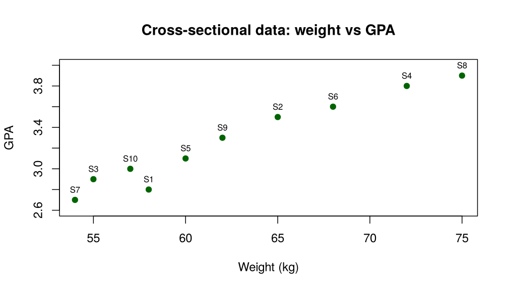

*Figure 1.1. Cross-sectional data: ten students measured once.*

Each point is one student. Shuffling the rows of the table would not change the
plot at all.

**Time series data** are observations on one entity (or a few) collected over
several time periods. The order of the observations is essential. For example,
the GPA of student S1 over eight semesters:


```r
s1 <- data.frame(semester = 1:8,
                 gpa = c(2.8, 3.0, 3.2, 3.4, 3.5, 3.6, 3.7, 3.8))
```


| Semester| GPA|
|--------:|---:|
|        1| 2.8|
|        2| 3.0|
|        3| 3.2|
|        4| 3.4|
|        5| 3.5|
|        6| 3.6|
|        7| 3.7|
|        8| 3.8|


```r
plot(s1$semester, s1$gpa, type = "o", pch = 19, col = "blue",
     main = "Time series data: student S1 GPA",
     xlab = "Semester", ylab = "GPA")
```

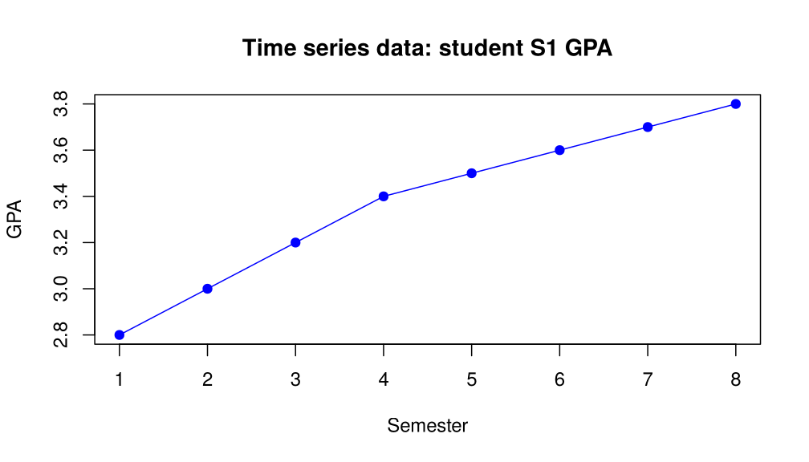

*Figure 1.2. Time series data: one student (S1) measured repeatedly.*

Here the line joining the points carries information: shuffling the semesters
would destroy the upward pattern.

Generalised linear models, in the first part of this course, usually describe
relationships in cross-sectional or panel data, where time may appear as a
covariate but is not the main structure. In this second part of the course we
study **time series data**.

> **Definition (Time series).** A *time series* is a set of observations
> $x_t$, each recorded at a specified time $t$. Usually the observations are
> taken at successive, equally spaced times. We model the observed series as a
> realisation of a sequence of random variables
>
> ```math
> X = \lbrace X_t : t = 1, 2, 3, \dots \rbrace.
> ```

Examples of time series:

- **Finance:** daily closing stock prices (e.g. MSFT), the monthly S&P 500 index.
- **Economics:** quarterly gross domestic product (GDP), monthly unemployment
  rates.
- **Industry:** hourly production volume of a factory, daily website traffic,
  minute-by-minute sensor readings from equipment.
- **Environment:** daily maximum temperatures, annual $\text{CO}_2$ concentrations.
- **Healthcare:** hourly heart rate of a patient, weekly new flu cases.

### 1.2 Objectives of time series analysis

1. **Description:** identify patterns, components (trend, seasonality) and
   outliers to understand the process that generated the data.
2. **Modelling:** develop a statistical model that describes the observed data
   and its dependence over time. This usually involves estimating parameters.
3. **Forecasting:** predict future values of the series from its past values
   and the fitted model. This is a primary goal in many applications.

> **Key idea.** A *forecast* is a prediction of some future event or events.

A forecast can be

- a **point forecast**: a single best estimate of the future value, or
- a **prediction interval (PI)**: a range that indicates the uncertainty of the
  forecast, which is more informative for decision-making.

Two design choices have to be made:

- **Forecast horizon:** how far ahead we predict (e.g. 3 months).
  - *Short-term:* hours, days or weeks; based on modelling and extrapolating
    patterns in the data.
  - *Medium-term:* one to two years ahead.
  - *Long-term:* several years ahead.
- **Forecast interval:** how often new forecasts are made (e.g. monthly).

When the forecasts for the next $T$ periods are revised every period, this is
called a **rolling** or **moving horizon** forecast. It is common in business and
production planning.

#### Quantitative forecasting methods

Quantitative forecasting methods make formal use of historical data through a
forecasting model. The model summarises patterns in the data and describes the
statistical relationship between past and current values, so that the patterns
can be extrapolated into the future.

**Regression methods** use the relationship between the variable of interest and
one or more predictors, for example forecasting the sales of one product from the
purchases of another product.


```r
set.seed(11)
purchases_A <- seq(0, 10, length.out = 30)
sales_B <- 1 + 2.3 * purchases_A + rnorm(30, sd = 4)
fit_AB <- lm(sales_B ~ purchases_A)

plot(purchases_A, sales_B, pch = 19, col = "blue",
     main = "Regression method: two product sales",
     xlab = "Purchases of product A", ylab = "Sales of product B")
abline(fit_AB, col = "red", lwd = 2)
legend("topleft", bty = "n", pch = c(19, NA), lty = c(NA, 1), lwd = c(NA, 2),
       col = c("blue", "red"),
       legend = c("Observed data",
                  sprintf("Fitted line: y = %.2f + %.2f x",
                          coef(fit_AB)[1], coef(fit_AB)[2])))
```

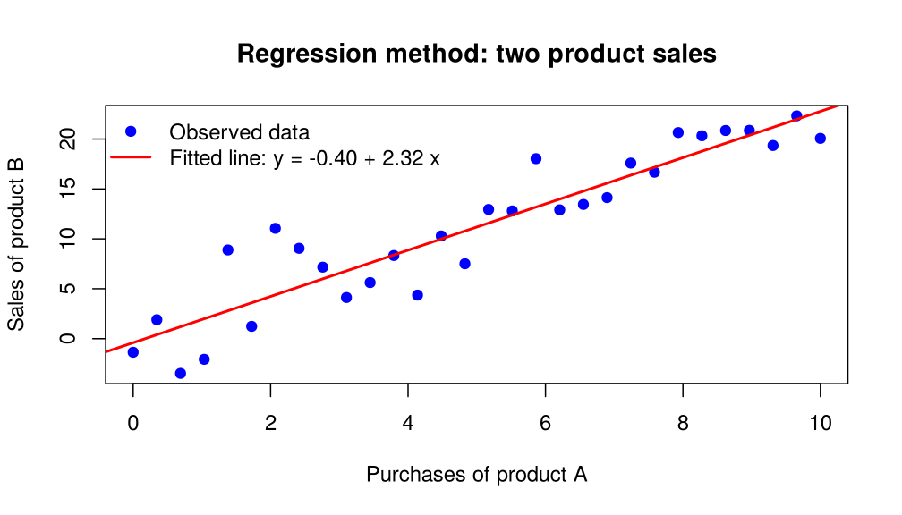

*Figure 1.3. Regression method: sales of product B against purchases of product A (simulated).*

Regression models are sometimes called *causal forecasting models*, because the
predictors are assumed to describe the forces that drive the variable of
interest.

**Smoothing methods** forecast the variable of interest by a simple function of
its previous observations. For example,

```math
\hat{y}_t = \frac{y_{t-1} + y_{t-2} + y_{t-3} + y_{t-4}}{4}
\qquad\text{or}\qquad
\hat{y}_t = 0.4\,y_{t-1} + 0.3\,y_{t-2} + 0.2\,y_{t-3} + 0.1\,y_{t-4},
```

where $\hat{y}_t$ is the forecast of $y$ at time $t$ and $y_{t-i}$ is the observed
value at time $t-i$, for $i = 1, 2, 3, 4$. Smoothing methods are easy to apply and
often work well with very little theory. The best-known one, exponential
smoothing, uses weights that decrease geometrically into the past; it returns
in Chapter 7 as the forecast of an IMA(1,1) model.

**Formal time series methods** use the statistical properties of the historical
data, through a model such as ARIMA whose unknown parameters are estimated from
past observations. These are the methods developed in this course.

## 2. Components of a time series

A time plot can reveal random variation, trends, level shifts, cycles, unusual
observations, or a combination of these. The patterns most commonly found in time
series data are:

- **Trend ($T_t$):** the long-term direction of the series: upward, downward or
  stable.
- **Seasonality ($S_t$):** a pattern that repeats over a fixed period (daily,
  weekly, monthly, quarterly, yearly). It is usually caused by factors such as
  weather, holidays or social customs.
- **Cycle ($C_t$):** long-term, wave-like fluctuations around the trend whose
  period is *not* fixed. Cycles are often linked to business cycles or other
  economic and environmental phenomena. They are harder to model than
  seasonality because their length and size vary.
- **Irregular component ($\epsilon_t$):** the unpredictable, random fluctuation
  ("noise") that remains after the other components have been accounted for.

The four series below are built into R. Each one shows a different
combination of these components.


```r
par(mfrow = c(2, 2), mar = c(4, 4, 3, 1))

# Trend: quarterly Australian residents (thousands), 1971-1993
plot(austres, type = "o", pch = 20, main = "Trend",
     xlab = "Year", ylab = "Residents (1000s)")

# Trend + seasonality: monthly CO2 at Mauna Loa (ppm), 1959-1997
plot(co2, main = "Trend + seasonality",
     xlab = "Year", ylab = expression(CO[2] ~ "(ppm)"))

# Cycles: yearly mean sunspot numbers, 1700-1988
plot(sunspot.year, main = "Cycles",
     xlab = "Year", ylab = "Sunspot number")

# Irregular only: luteinizing hormone, 48 samples at 10-minute intervals
plot(lh, type = "o", pch = 20, main = "Irregular fluctuation",
     xlab = "Sample (10-minute intervals)", ylab = "Hormone level")
```

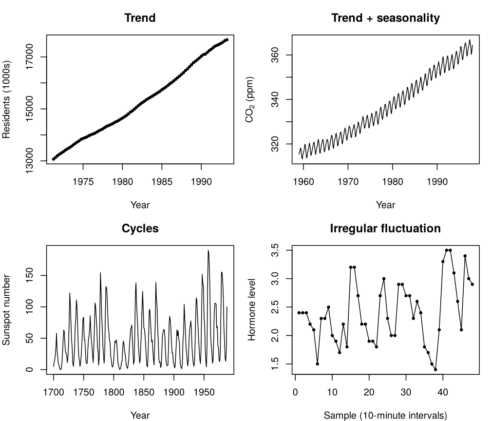

*Figure 1.4. Four series with different components. Data sets built into R: austres, co2, sunspot.year, lh.*

```r
par(mfrow = c(1, 1))
```

The sunspot numbers rise and fall in cycles of roughly 9 to 14 years, and the
peaks have different heights. These are cycles, not seasonality: the length of
each cycle changes. Unemployment rates behave in a similar way, rising and
falling with recessions and recoveries over several years.

**Decomposition models.** Two common ways of combining the components are

- the **additive model**, $Y_t = T_t + S_t + C_t + \epsilon_t$, in which the size
  of the seasonal and random fluctuations does not depend on the level of the
  trend, and
- the **multiplicative model**, $Y_t = T_t \times S_t \times C_t \times
  \epsilon_t$, in which the fluctuations grow in proportion to the level of the
  trend.

A log transformation turns a multiplicative model into an additive one:

```math
\log Y_t = \log T_t + \log S_t + \log C_t + \log \epsilon_t .
```


```r
t <- 1:60
trend <- 10 + 2 * t
season <- sin(2 * pi * t / 12)

Y_add <- trend + 5 * season          # additive model
Y_mul <- trend * (1 + 0.3 * season)  # multiplicative model

par(mfrow = c(2, 1), mar = c(4, 4, 3, 1))
plot(t, Y_add, type = "l", col = "blue", lwd = 2,
     main = "Additive model", xlab = "Time", ylab = "Y (additive)")
plot(t, Y_mul, type = "l", col = "darkorange", lwd = 2,
     main = "Multiplicative model", xlab = "Time", ylab = "Y (multiplicative)")
```

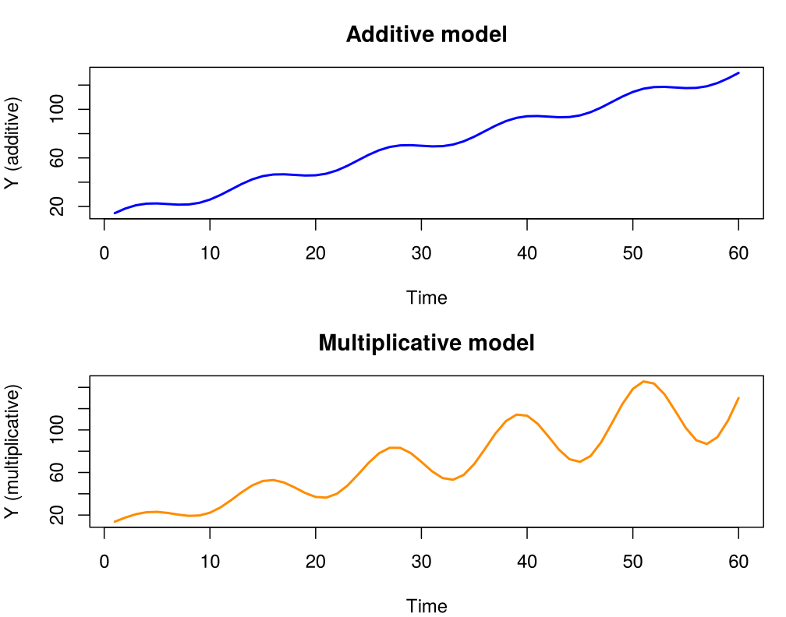

*Figure 1.5. The same trend and seasonal pattern combined additively and multiplicatively.*

```r
par(mfrow = c(1, 1))
```

In the additive series the seasonal swings have the same size throughout. In the
multiplicative series they grow with the trend.

## 3. Some simple time series models

An essential part of time series analysis is choosing a suitable probability
model for the data. We assume that each observed value $x_t$ is a realisation of
a random variable $X_t$.

A **time series model** specifies the joint distributions of these random
variables, or at least their means and covariances. In practice we rarely
specify the full joint distributions. Instead we work with second-order
properties (means, variances and covariances), which are enough to describe
linear dependence and to build forecasting models.

### 3.1 Zero-mean models

**IID noise.** The simplest time series model has no trend or seasonality, and
the observations $X_t$ are **independent and identically distributed (iid)**
with mean $0$. Formally,

```math
\Pr(X_1 \le x_1, \dots, X_n \le x_n) = \prod_{i=1}^n F(x_i),
```

where $F(\cdot)$ is the common distribution function of the $X_t$. This means
that

- there is **no dependence** between observations;
- knowing $X_1, \dots, X_n$ tells us nothing about a future value $X_{n+h}$;
- if the variance is finite, the best forecast of any future value in the
  mean-square sense is simply its mean, $0$.


```r
set.seed(1)
n <- 200
x <- rnorm(n, mean = 0, sd = 1)  # iid N(0, 1)
plot(ts(x), main = "IID noise: N(0, 1)", xlab = "t", ylab = expression(x[t]))
abline(h = 0, col = "grey50", lty = 2)
```

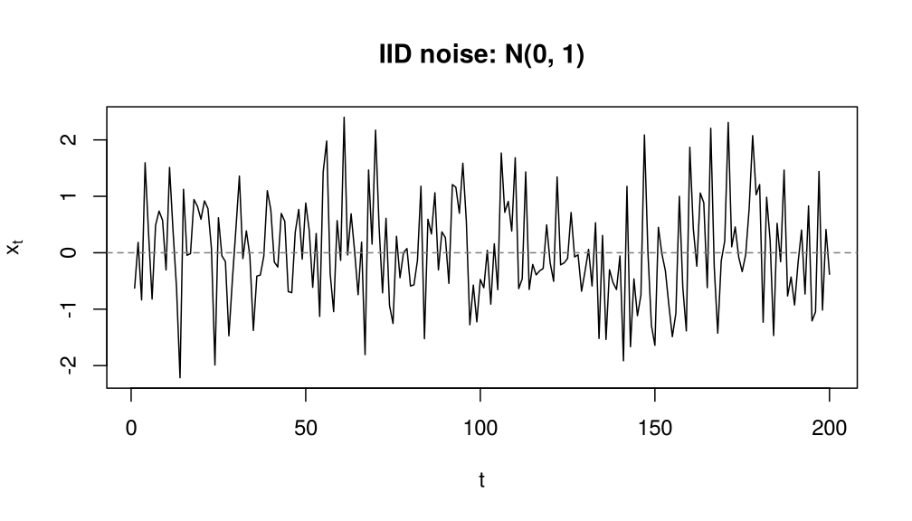

*Figure 1.6. Simulated iid N(0, 1) noise.*

**Binary process.** A simple discrete-valued iid process is

```math
\Pr(X_t = 1) = p, \qquad \Pr(X_t = -1) = 1 - p .
```

For $p = 0.5$ this describes tosses of a fair coin ($+1$ for heads, $-1$ for
tails). Although simple, it can model two-state processes such as wins and
losses in a sports season.

**Random walk.** The random walk is the cumulative sum of iid noise,

```math
S_t = X_1 + X_2 + \cdots + X_t ,
```

or, recursively, $S_t = S_{t-1} + X_t$ with $S_0 = 0$.


```r
set.seed(2)
n <- 200
eps <- rnorm(n, mean = 0, sd = 1)
S <- cumsum(eps)  # random walk: S_t = S_{t-1} + eps_t
plot(ts(S), main = "Random walk", xlab = "t", ylab = expression(S[t]))
abline(h = 0, col = "grey50", lty = 2)
```

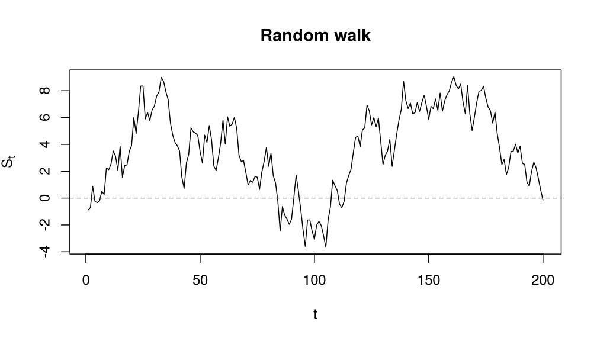

*Figure 1.7. A simulated random walk started at zero.*

> **Question.** What are the mean and variance of $S_t$?


### 3.2 Models with trend

Many real series have **deterministic components** such as a trend or a
periodic pattern. We can represent such data as

```math
X_t = m_t + Y_t ,
```

where $m_t$ is a deterministic **trend** and $Y_t$ is a stochastic component with
zero mean. A **polynomial trend** has the form

```math
m_t = a_0 + a_1 t + a_2 t^2 + \cdots + a_k t^k ,
```

and the parameters $a_0, a_1, \dots, a_k$ are usually estimated by **least
squares**.

<!-- box: example -->
**Example: Level of Lake Huron, 1875–1972**

The data set `LakeHuron` in R records the annual water level of Lake Huron, in
feet. We measure the level in feet above 570 ft and number the years
$t = 1, \dots, 98$. The level declines roughly linearly over time, so we fit

```math
X_t = a_0 + a_1 t + Y_t , \qquad t = 1, \dots, 98 ,
```

where $Y_t$ is the stochastic (noise) component.


```r
level <- as.numeric(LakeHuron) - 570  # feet above 570 ft
t <- seq_along(level)                 # t = 1, ..., 98
fit_lake <- lm(level ~ t)
coef(fit_lake)
```

```
#> (Intercept)           t 
#> 10.20203661 -0.02420111
```

```r
plot(1875:1972, level, type = "o", pch = 0,
     main = "Level of Lake Huron, 1875-1972",
     xlab = "Year", ylab = "Level (feet above 570 ft)")
lines(1875:1972, fitted(fit_lake), lwd = 2)
```

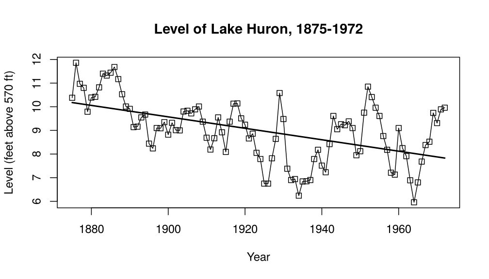

*Figure 1.8. Level of Lake Huron (feet above 570 ft) with the least-squares trend line.*

The least-squares estimates are $\hat{a}_0 = 10.202$ and
$\hat{a}_1 = -0.0242$, so the fitted trend line is

```math
\hat{X}_t = 10.202 - 0.0242\,t .
```
<!-- /box -->

### 3.3 Deterministic and stochastic trends

A trend seen in a plot need not be deterministic. The random walk of
Section 3.1 has mean $0$ for all $t$, yet a single realisation often drifts
steadily up or down, because neighbouring values are strongly correlated and
the variance of $S_t$ grows with $t$. Three realisations of the *same*
process can show quite different "trends":


```r
set.seed(31)
walks <- replicate(3, cumsum(rnorm(60)))   # three random walks, t = 1..60
matplot(walks, type = "l", lty = 1, lwd = 2,
        col = c("black", "steelblue", "firebrick"),
        main = "Three realisations of one random walk",
        xlab = "t", ylab = expression(S[t]))
abline(h = 0, col = "grey50", lty = 2)
```

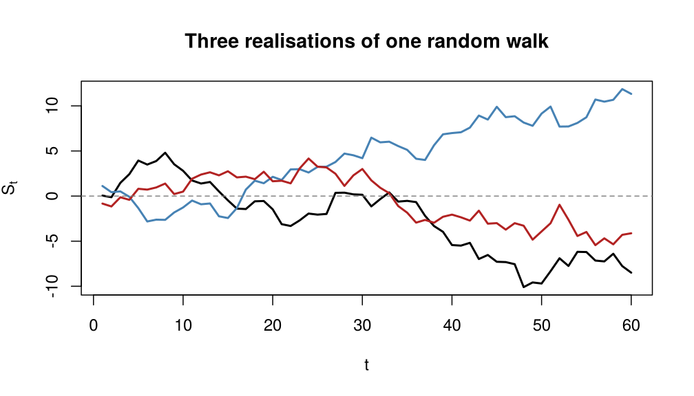

*Figure 1.9. Three simulated realisations of the same random walk; each seems to have its own trend.*

Such apparent trends are sometimes called **stochastic trends**. A
**deterministic trend**, such as $m_t = a_0 + a_1 t$ in the model
$X_t = m_t + Y_t$, is different: it is part of the mean function and is assumed
to hold for all time, not only over the observed period. We should have a
reason for such an assumption beyond the series looking roughly linear.

**Removing a trend.** Suppose $X_t = m_t + Y_t$ with $Y_t$ stationary
(Chapter 2). There are two standard ways to remove the trend. **Detrending**
estimates $m_t$ by regression, as for Lake Huron, and works with the residuals
$\hat Y_t = X_t - \hat m_t$. **Differencing** works with $X_t - X_{t-1}$. For a
linear trend $m_t = a_0 + a_1 t$,

```math
X_t - X_{t-1} = a_1 + Y_t - Y_{t-1},
```

and for a stochastic trend $m_t = \delta + m_{t-1} + w_t$ (a random walk with
drift $\delta$, where $w_t$ is iid noise independent of $Y_t$),

```math
X_t - X_{t-1} = \delta + w_t + Y_t - Y_{t-1}.
```

In both cases the differenced series is stationary. Differencing estimates no
parameters, but it does not recover $Y_t$; detrending gives an estimate of
$Y_t$, but only makes sense if the trend really is deterministic. Chapter 6
studies differencing (and the harm done by differencing too often), and the
augmented Dickey-Fuller test of Chapter 7 helps to decide between a
deterministic trend with stationary deviations and a unit root.

**Seasonal deterministic trends.** For monthly data a deterministic seasonal
mean satisfies $m_t = m_{t-12}$. The most general form is the **seasonal means
model**, with one parameter per month,

```math
m_t = \beta_j \quad \text{when } t \text{ falls in month } j, \qquad j = 1, \dots, 12 .
```

A more economical **cosine (harmonic) trend** describes a smooth annual cycle,

```math
m_t = \beta_0 + \beta_1 \cos(2\pi f t) + \beta_2 \sin(2\pi f t),
```

where $f$ is the frequency: $f = 1/12$ if $t$ counts months, $f = 1$ if $t$ is
measured in years. The amplitude of the cycle is $\sqrt{\beta_1^2 + \beta_2^2}$.
Both models are linear in the parameters and are fitted by least squares.

<!-- box: rexample -->
**R example: Monthly temperatures at Nottingham**

The built-in series `nottem` gives the average monthly air temperature at
Nottingham Castle, in degrees Fahrenheit, 1920–1939. Its time index is in
years, so we use $f = 1$.


```r
t <- as.numeric(time(nottem))   # 1920, 1920.083, ... (years)
fit_cos <- lm(nottem ~ cos(2 * pi * t) + sin(2 * pi * t))  # 3 parameters
month <- factor(cycle(nottem))  # month 1, ..., 12
fit_means <- lm(nottem ~ month - 1)                         # 12 parameters

round(coef(fit_cos), 2)
```

```
#>     (Intercept) cos(2 * pi * t) sin(2 * pi * t) 
#>           49.04          -11.47           -1.39
```

```r
round(c(cosine = summary(fit_cos)$sigma,
        means = summary(fit_means)$sigma), 2)   # residual SD
```

```
#> cosine  means 
#>   2.54   2.31
```

```r
show <- t < 1928
plot(t[show], nottem[show], type = "p", pch = 20,
     main = "Nottingham temperature with two seasonal trends",
     xlab = "Year", ylab = "Temperature (F)")
lines(t[show], fitted(fit_cos)[show], col = "red", lwd = 2)
lines(t[show], fitted(fit_means)[show], col = "blue", lty = 2)
```

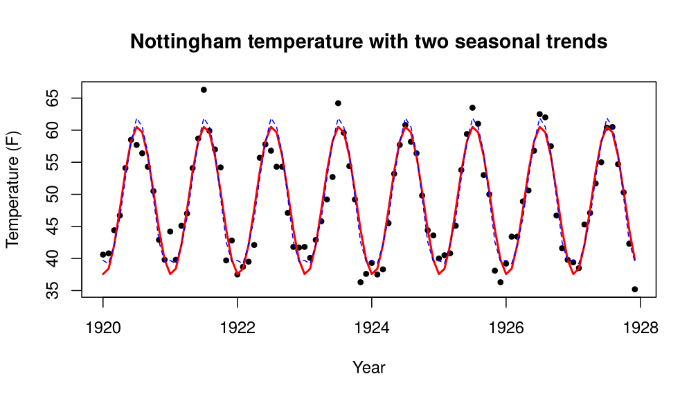

*Figure 1.10. Monthly air temperature at Nottingham, 1920-1939 (first eight years shown), with the fitted cosine trend (red) and the seasonal means (blue).*

The cosine curve has amplitude
$11.6$ degrees around a mean of
$49$ degrees Fahrenheit and follows the annual cycle closely with
3 parameters. The seasonal means model uses 12 and fits a little better
(residual SD 2.31 against
2.54), mainly because December to February
have almost equal means, a flat winter that a single cosine cannot reproduce.
<!-- /box -->

> **Further reading.** Cryer and Chan (2008), Sections 3.1 and 3.3; Shumway
> and Stoffer (2017), Section 2.2.

### 3.4 General approach to time series modelling

1. **Plot the data.** Look for trend, seasonality, sudden changes and outliers.
2. **Transform the data** (e.g. take logs) if the variance grows with the level.
3. **Remove the trend and seasonality**, by regression or by differencing.
4. **Model the residuals**, using the ACF and PACF to choose an AR, MA or ARMA
   structure.
5. **Forecast and reconstruct** the original series by adding back the trend and
   seasonal components.

## 4. Visualising time series

The **time plot**, the observations plotted against time, is the most important
tool. It helps us to see

- trends (upward, downward or flat);
- seasonality (repeating patterns);
- cycles (longer waves);
- outliers (unusual points);
- changes in variance;
- structural breaks (sudden changes in the pattern).

In base R, `plot()` draws a time plot of any `ts` object:


```r
# my_ts_data is any time series (ts) object
plot(my_ts_data, main = "Time plot of my data", xlab = "Time", ylab = "Value")
```

<!-- box: example -->
**Example: AirPassengers with base R**

The built-in data set `AirPassengers` is a `ts` object: monthly totals of
international airline passengers (in thousands), 1949–1960.


```r
my_ts_data <- AirPassengers

plot(my_ts_data,
     main = "Time plot of AirPassengers",
     xlab = "Year", ylab = "Passengers (1000s)")
```

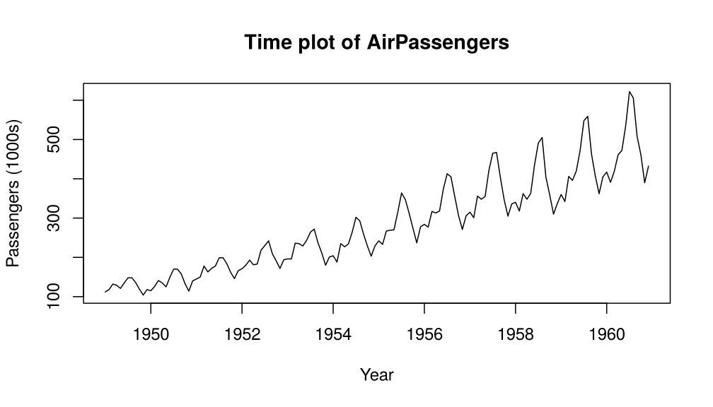

*Figure 1.11. Time plot of AirPassengers drawn with base R.*
<!-- /box -->

## 5. Basic time series objects in R

A time series in R is more than a vector of numbers: it is a numeric sequence
**with time information** (start, frequency and order).

> A vector only stores numbers. A time series object also remembers *when* each
> number was observed.

The function `ts()` creates a time series object. Its main arguments are

- `data`: a numeric vector or matrix of the observed values;
- `start`: the time of the first observation, either one number (e.g. a year)
  or two numbers `c(year, period)`, such as `c(2020, 1)` for January 2020 when
  the frequency is 12;
- `end`: the time of the last observation;
- `frequency`: the number of observations per unit of time (1 for annual, 4 for
  quarterly, 12 for monthly, 52 for weekly data).

<!-- box: example -->
**Example: Monthly sales as a ts object**


```r
sales_data <- c(10, 12, 15, 13, 17, 20, 18, 22, 25, 23, 28, 30,
                12, 14, 17, 15, 19, 22, 20, 24, 27, 25, 30, 32,
                15, 16, 19, 18, 21, 24, 23, 26, 29, 28, 33, 35)

# Monthly data starting in January 2020, three years
sales_ts <- ts(sales_data, start = c(2020, 1), frequency = 12)
print(sales_ts)
```

```
#>      Jan Feb Mar Apr May Jun Jul Aug Sep Oct Nov Dec
#> 2020  10  12  15  13  17  20  18  22  25  23  28  30
#> 2021  12  14  17  15  19  22  20  24  27  25  30  32
#> 2022  15  16  19  18  21  24  23  26  29  28  33  35
```

```r
plot(sales_ts, main = "Monthly sales", xlab = "Year", ylab = "Sales")
```

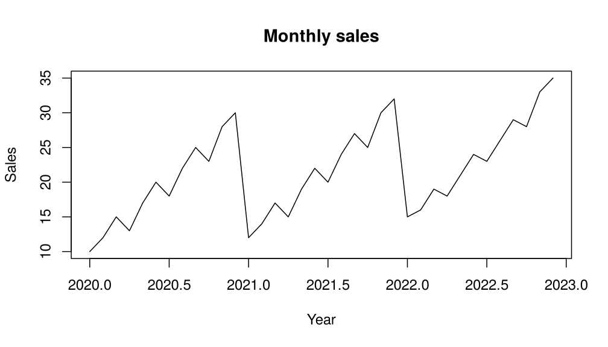

*Figure 1.12. Monthly sales, January 2020 to December 2022.*
<!-- /box -->

**Decomposition with `decompose()`.** `decompose(x, type = "additive")` (or
`type = "multiplicative"`) is the classical decomposition into trend, seasonal
and random parts. It is simple, but the trend is estimated by a moving average,
so it is missing for the first and last six months of monthly data.


```r
decomposed_sales_add <- decompose(sales_ts, type = "additive")
plot(decomposed_sales_add)
```

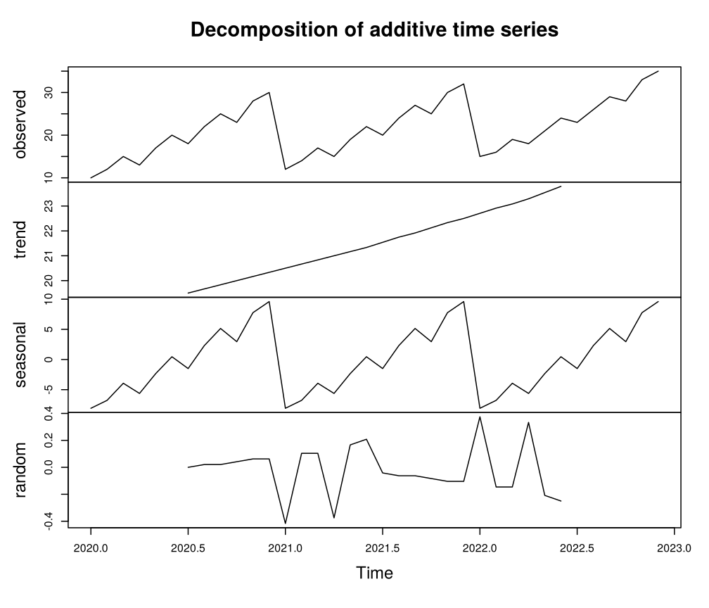

*Figure 1.13. Classical additive decomposition of the monthly sales.*

```r
# If a multiplicative model seems more appropriate:
# decomposed_sales_mult <- decompose(sales_ts, type = "multiplicative")
# plot(decomposed_sales_mult)
```

**Decomposition with `stl()`.** `stl(x, s.window = "periodic")` is the
"Seasonal and Trend decomposition using Loess". It is more robust and flexible
than `decompose()`. The argument `s.window` controls how smooth the seasonal
component is; `"periodic"` forces the same seasonal pattern every year.


```r
stl_sales <- stl(sales_ts, s.window = "periodic")
plot(stl_sales)
```

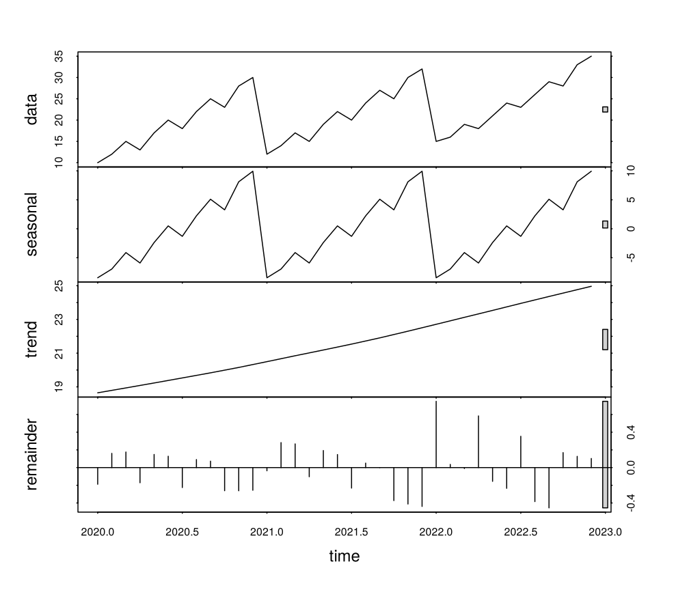

*Figure 1.14. STL decomposition of the monthly sales.*

```r
# stl() is part of base R (package stats); no extra package is needed.
```

## Chapter checkpoint

Before moving on, make sure you can answer these questions in words.

1. What makes time series data different from cross-sectional data?
2. Why is the order of the observations important?
3. What can a time plot reveal before any formal model is fitted?
4. If a series has trend and seasonality, why might a simple average be
   misleading?
5. Why can a random walk look as if it had a trend, and what does a
   deterministic trend assume that a stochastic trend does not?

Short in-class task: choose one real example, such as monthly sales, daily
temperature, exchange rates or weekly website visits. State the time unit, the
observed variable, and one question a time series model could help answer.


## Modern time-series thread 1: One sequence, several AI questions

The classical chapters of this course concentrate on **forecasting**: using the
past to predict future values. Modern time-series analysis starts one step
earlier, by asking which decision has to be made from the sequence. The same
sensor stream can support several different tasks, and each task needs a
different target, model output and evaluation method.

### The modern task map

Let the most recent look-back window be

```math
\mathbf{z}_t = (X_{t-L+1}, \ldots, X_t),
```

where $L$ is the number of past observations given to the model. A modern model
learns a function $g_\theta(\mathbf{z}_t)$, but the meaning of its output depends
on the task.

| Task | Question | Typical model output | Example method |
| --- | --- | --- | --- |
| Forecasting | What will happen next? | $\hat X_{t+1}, \ldots, \hat X_{t+H}$ | ARIMA, LSTM, Transformer |
| Classification | What type of sequence is this? | Class probabilities | Temporal CNN, shapelet model |
| Anomaly detection | Is this point or segment unusual? | Anomaly score $s_t$ | Forecast-residual rule, contrastive detector |
| Imputation | Which values are missing? | Estimated entries $\hat X_t$ | Interpolation, SAITS |
| Clustering | Which sequences behave similarly? | Cluster or learned representation | Distance- or representation-based clustering |

The first chapter of *AI for Time Series* organises modern work around
forecasting, classification, anomaly detection, imputation and clustering. This
wider map helps to avoid a common mistake: choosing a forecasting model when the
real problem is fault detection or data repair.

### Model idea: a shared representation, task-specific output

Many modern systems work in two stages.

1. An **encoder** converts the look-back window into a compact representation,
   $\mathbf{h}_t = f_\theta(\mathbf{z}_t)$.
2. A **task head** converts $\mathbf{h}_t$ into the required output, for example

```math
\hat X_{t+1:t+H} = g_{\text{forecast}}(\mathbf{h}_t),
\qquad
s_t = g_{\text{anomaly}}(\mathbf{h}_t).
```

Later threads connect classical models to particular encoders: temporal
convolutions learn local filters, LSTMs keep a recurrent memory, and
frequency-aware models work with periodic components.

### Use case: one industrial sensor stream

Suppose a factory records temperature, vibration and power consumption every
minute.

- Forecasting estimates the power demand for the next hour.
- Classification identifies the machine's operating mode.
- Anomaly detection raises an alert for an unusual vibration segment.
- Imputation repairs a block of data lost during a network outage.
- Clustering groups machines with similar operating profiles.

The observations are the same, but the statistical question changes, and so the
train/test split and the evaluation measure must change too.

**In-class activity: task-framing clinic (25 minutes).** Work in groups of
three. For each request below, identify the task, the model input, the desired
output, and one way to evaluate success.

1. Predict tomorrow's peak electricity demand.
2. Decide whether a 30-second ECG segment shows a normal or abnormal rhythm.
3. Find previously unknown types of customer-demand profiles.
4. Recover six missing hourly pollution measurements.
5. Alert an engineer when a pump begins behaving unusually.

Then run the code below. It creates a small sensor stream that contains both a
missing block and an abnormal spike. Mark which observations belong to the
**data-quality problem** and which belong to the **system-behaviour problem**.


```r
set.seed(311)
n <- 120
t <- 1:n
sensor <- 20 + 0.01 * t + sin(2 * pi * t / 24) + rnorm(n, 0, 0.15)

sensor_with_events <- sensor
sensor_with_events[45:49] <- NA                # communication failure
sensor_with_events[85] <- sensor[85] + 4       # unusual physical event

plot(sensor_with_events, type = "o", pch = 16,
     main = "One stream, two different problems",
     xlab = "Minute", ylab = "Sensor value")
abline(v = c(45, 49, 85), col = c("steelblue", "steelblue", "firebrick"),
       lty = 2)
```

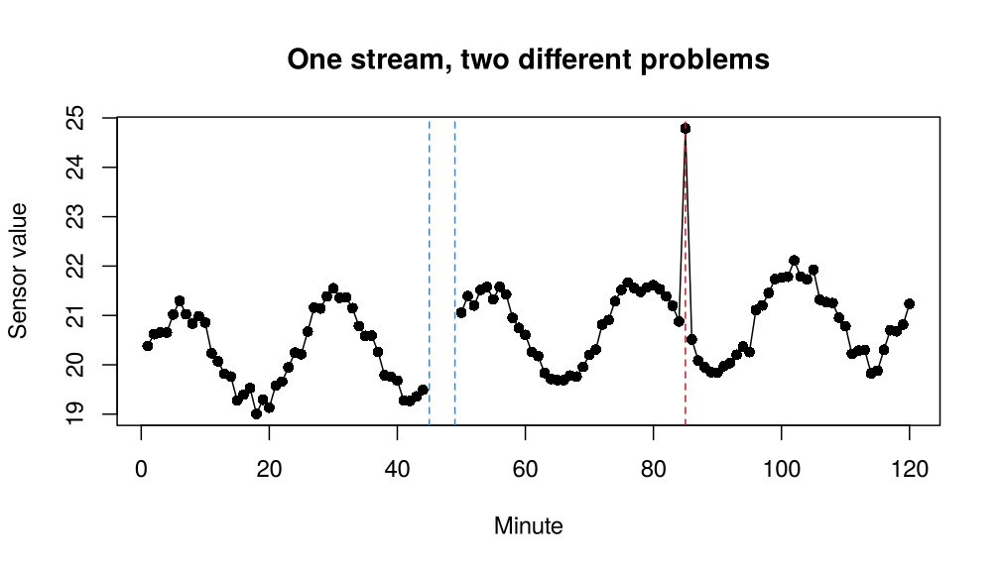

*Figure 1.15. A simulated sensor stream with a missing block (minutes 45-49) and a spike (minute 85).*


<!-- box: reading -->
**Modern reading**

*AI for Time Series*, Chapter 1, especially the task taxonomy, the benchmark
data sets, and the overview of recurrent, convolutional, attention-based and
graph-based models.
<!-- /box -->
